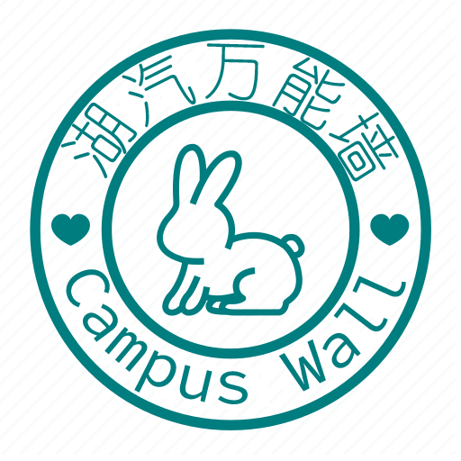

<!-- Start of Selection -->

<!-- Logo -->

  
   

<h3><b>湖汽万能墙</b></h3>

<!-- 项目描述 -->

# 📖 湖汽万能墙 

> 湖汽万能墙是一个用于校园信息共享和交流的项目，本仓库为小程序源码。

## 🛠 技术栈 

### 技术栈 

> 本项目采用B/S架构，前端使用Vue.js，Uniapp。

  
客户端

  <ul>
    <li><a href="https://vuejs.org/">Vue.js</a></li>
  </ul>

(<a href="#readme-top">返回顶部</a>)

<!-- 在线演示 -->

## 🚀 在线演示 

暂无

(<a href="#readme-top">返回顶部</a>)

<!-- 快速开始 -->

## 💻 快速开始 

暂无